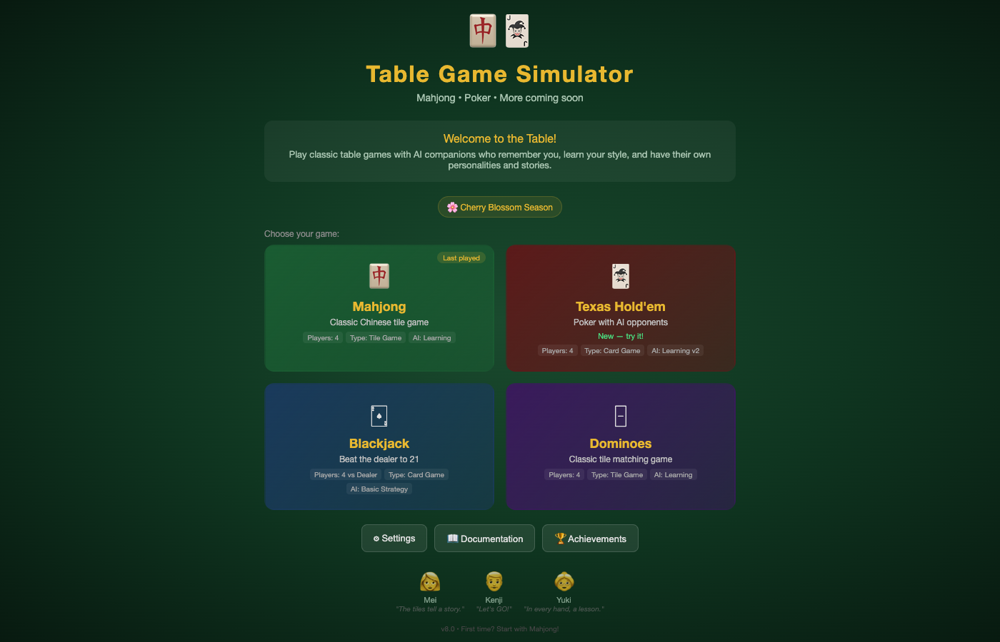
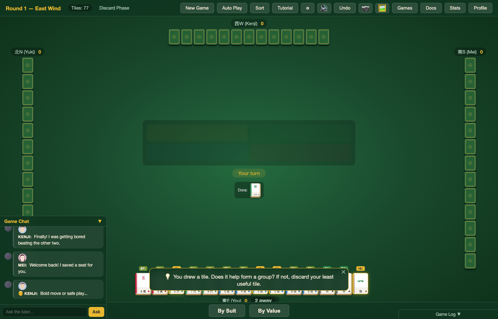
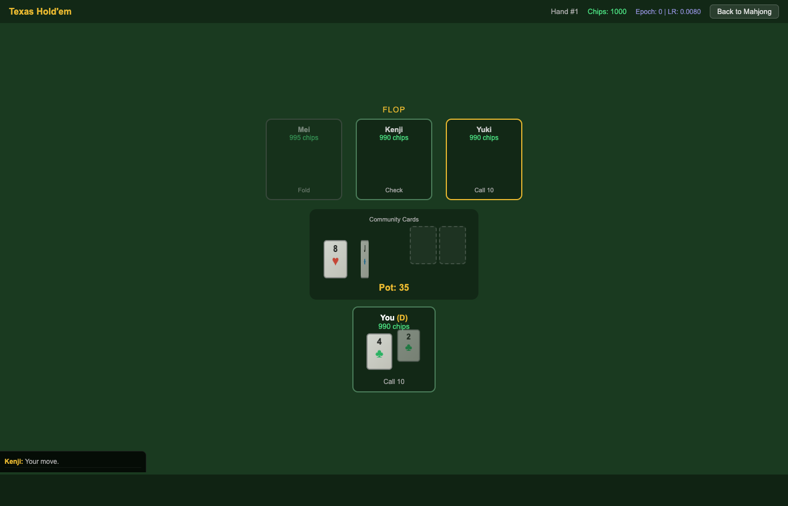
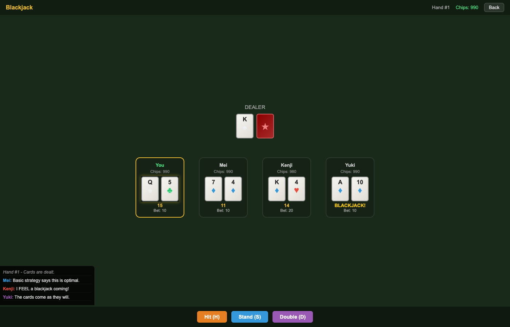
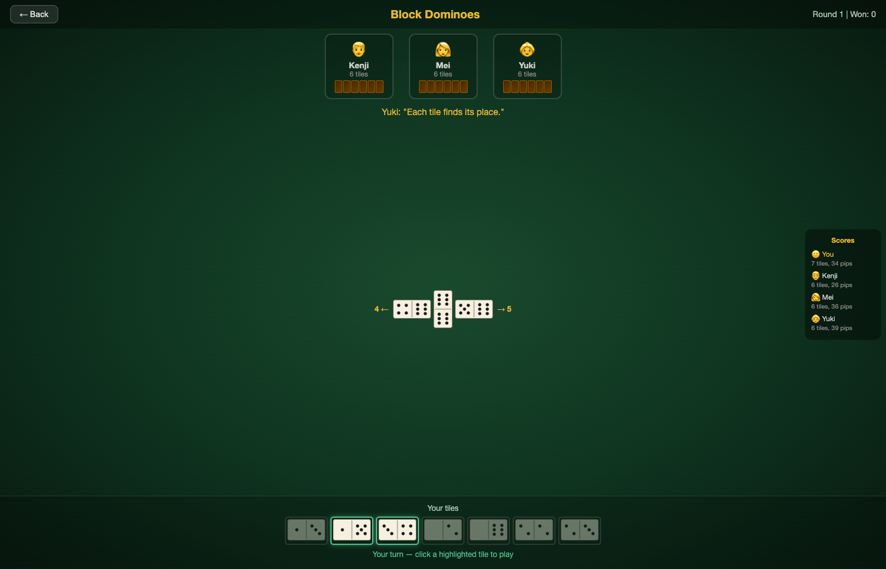
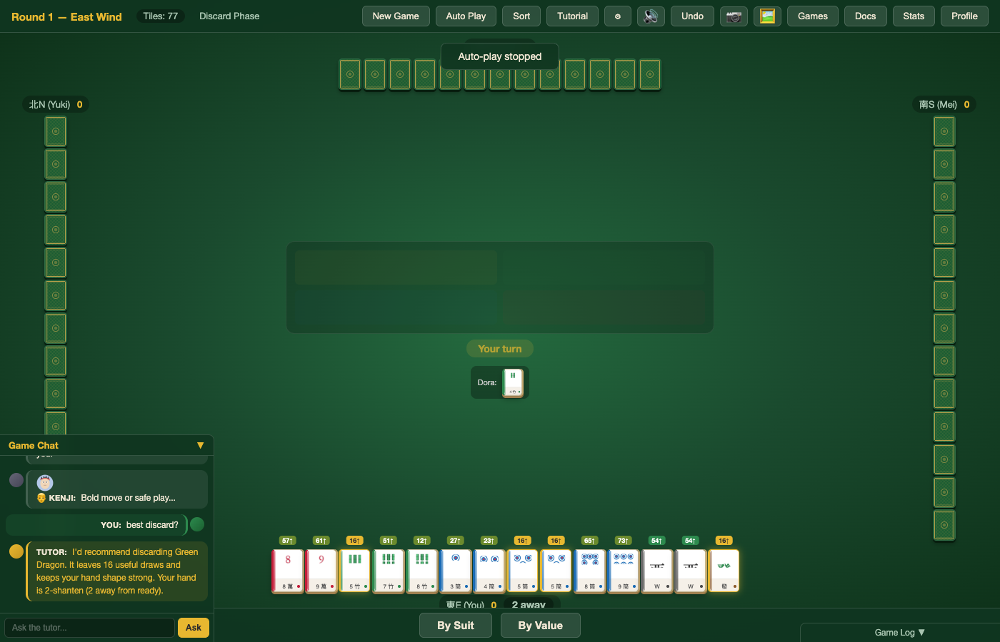
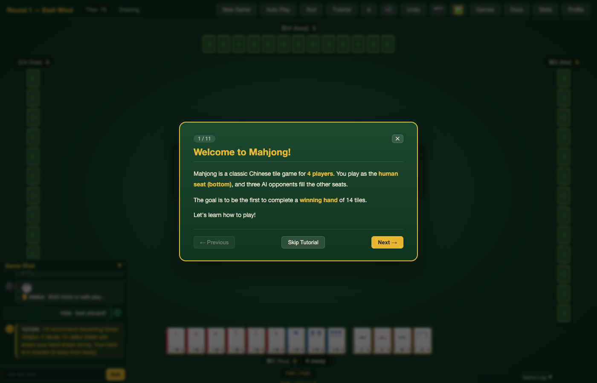
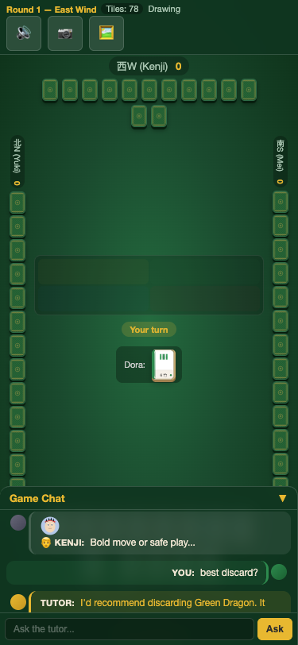
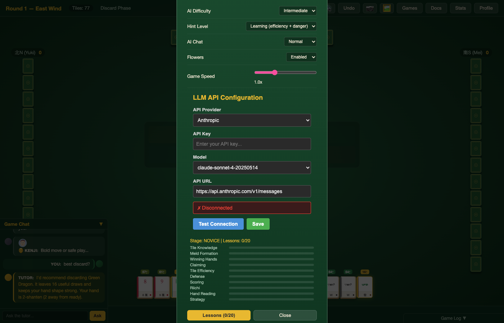

# Table Game Simulator

A living multi-game table game simulator with AI opponents who have persistent personalities, memories, and emotions that carry across games. Built entirely in vanilla JavaScript — no frameworks, no build tools required.



## Games

| Game | Description | AI |
|------|-------------|-----|
| 🀄 **Mahjong** | Chinese tile game with riichi, dora, flowers, furiten, 6 rule variants | EV-based with shanten/ukeire efficiency, push/fold, score situation awareness |
| 🃏 **Poker** | Texas Hold'em with full betting (fold/check/call/raise/all-in) | Monte Carlo hand strength, opponent modeling, multi-street planning, learning v2 |
| 🂡 **Blackjack** | 6-deck shoe, hit/stand/double/split, 3:2 blackjack payout | Basic strategy with personality deviations, adaptive thresholds, card counting (Mei) |
| 🁣 **Dominoes** | Block dominoes (double-six), play on chain ends, 4 players | Tile counting, blocking strategy, option-maximizing, personality-driven |

### Mahjong



### Poker



### Blackjack



### Dominoes



## Quick Start

```bash
# No installation needed — just open in a browser
open index.html

# Or serve locally
python3 -m http.server 8080
open http://localhost:8080
```

## Features

### AI Characters

Three AI opponents with rich personalities that persist across all games:

- **Mei** (👩) — Cautious data analyst from Osaka. Plays tight, calculates odds, rarely bluffs. Her cat Mochi makes occasional cameo appearances.
- **Kenji** (👨) — Ex-poker pro turned ramen shop owner. Aggressive, emotional, trash-talks lovingly. Tilts after losses but learns patience over time.
- **Yuki** (👵) — Retired literature professor. Plays to honor her late husband Takeshi. Wise, unflappable, quotes literature. Sees each game as a life lesson.

Characters remember you across sessions, develop relationships, and have multi-part story arcs that unfold over dozens of games.



### AI Learning

Every game has a persistent learning system:

- **Mahjong**: 8 tunable weights (aggression, defense, efficiency, hand value) adapt based on win/loss rates
- **Poker**: 11 weights (tightness, bluff frequency, c-bet rate, bet sizing) with opponent profile persistence
- **Blackjack**: Adjusts stand/hit thresholds based on bust rate and win rate
- **Dominoes**: Adjusts aggression and pip priority from block rate and outcomes
- **Cross-game**: Emotional state transfers between games — Kenji tilting in Poker plays worse in Mahjong

### Living World

- **20-level reputation system** with titles (Novice → Dragon of Mahjong)
- **Virtual economy** — earn coins from wins, spend on cosmetic tile sets and accessories
- **Seasonal events** — Cherry Blossom Season, Friday Night Mahjong, New Year bonuses
- **Story arcs** — multi-session narratives (Kenji's Ramen Crisis, Yuki's Final Lesson, Mei's Discovery)
- **Character aging** — over hundreds of games, characters evolve permanently
- **Daily challenges** — rotating objectives with bonus XP
- **Campaigns** — 3 multi-stage challenge series (Dragon Path, Defensive Mastery, Art of Mahjong)
- **Tournaments** — 8-player elimination brackets
- **Character quests** — 9 unique quests unlocking permanent gameplay bonuses

### Teaching & Tutoring

- **Interactive tutorials** for all 4 games (8-10 steps each)
- **Practice puzzles** — 43 puzzles total (best discard, identify waits, claim decisions, basic strategy, tile counting)
- **Hint overlays** — show optimal play before you act (tile efficiency, pot odds, basic strategy, blocking)
- **LLM tutor** — chat interface for asking questions ("What should I discard?", "Should I bluff?")
- **Post-round report cards** — grades your play A+ through D with specific feedback
- **Guided first game** — step-by-step walkthrough pausing at key moments



### Documentation

14 comprehensive documents (8,285 lines total) accessible via in-game doc viewer with full-text search:

| Document | Lines | Content |
|----------|-------|---------|
| Mahjong Rulebook | 1,064 | Complete rules, all scoring patterns, special situations |
| Mahjong Tutorial | 1,062 | 12-chapter beginner guide with exercises |
| Mahjong Strategy | 994 | Tile efficiency, defense, push/fold, hand reading |
| Mahjong History | 516 | Origins, global spread, cultural significance |
| Game Help | 766 | Complete guide to all simulator features |
| Poker Rulebook | 668 | Texas Hold'em rules, hand rankings, positions |
| Poker Strategy | 549 | Starting hands, pot odds, bluffing, opponent reading |
| Blackjack Rulebook | 686 | Card values, actions, dealer rules, payouts |
| Blackjack Strategy | 498 | Basic strategy charts, card counting, common mistakes |
| Dominoes Rulebook | 548 | Double-six rules, gameplay, scoring, variations |
| Dominoes Strategy | 484 | Tile counting, blocking, endgame, reading opponents |
| Dragon Campaign | 166 | Campaign storyline and progression |
| Dragon Rulebook | 154 | Dragon campaign rules and mechanics |
| Dragon Strategy | 130 | Tips for completing dragon campaign challenges |


### Media & Presentation

- **SVG tile graphics** — custom-drawn Mahjong tiles with concentric circles, cylindrical bamboo, engraved kanji
- **Procedural music** — ambient soundtrack with mood-reactive shifts (calm/tense/victory)
- **Voice synthesis** — characters speak via Web Speech API with distinct voices
- **SVG character portraits** — emotion-reactive expressions (happy/sad/tilted/serene)
- **5 themed venues** — Home, Sakura Café, Tournament Hall, Midnight Rooftop, Zen Garden
- **Sound effects** — 14 distinct synthesized sounds (classic + modern packs)
- **Dealing animations** — staggered tile entrance, card flip reveals, domino placement

### Technical

- **PWA** — installable on mobile home screens, works offline via service worker
- **Multiplayer** — WebSocket client infrastructure (server included)
- **Cloud sync** — save data upload/download via REST API (server included)
- **4-language localization** — English, Japanese (日本語), Chinese (中文), Korean (한국어)
- **Accessibility** — screen reader support, high contrast mode, large text, reduced motion
- **Mobile responsive** — touch events, viewport scaling, landscape optimization
- **Production bundler** — concatenates 95 critical scripts into single file (1.3MB)



## Architecture

```
├── index.html              # Entry point (loads all modules)
├── css/                    # 6 stylesheets (main, tiles, tutorial, animations, tutor, mobile)
├── js/                     # 126 core modules
│   ├── poker/              # 14 poker modules
│   ├── blackjack/          # 8 blackjack modules
│   └── dominoes/           # 8 dominoes modules
├── docs/                   # 14 markdown documentation files
├── server/                 # Express + SQLite backend
├── python/                 # Python AI bridge + WebSocket server
├── sw.js                   # Service worker for offline play
├── manifest.json           # PWA manifest
├── build.js                # Production bundler
├── run-headless.js         # Headless Mahjong test runner
├── run-poker-test.js       # Poker AI test suite
└── run-poker-headless.js   # Headless poker simulation
```

All JavaScript uses the IIFE module pattern with a shared `window.MJ` namespace. No import/export, no bundler required for development — just open `index.html`.

## Running Tests

```bash
# Mahjong module tests (Node.js)
node js/test-modules.js

# Poker AI tests (Node.js)
node run-poker-test.js

# Headless Mahjong games
node run-headless.js --games 10 --verbose

# Headless poker simulation (100 hands)
node run-poker-headless.js 100

# Browser integration tests (Puppeteer)
node test-all-games.js

# Python AI training
python3 python/ai_bridge.py --train 200
```

## Headless Mode

Play Mahjong without a browser for AI training and testing:

```bash
# Quick game
node run-headless.js --games 4

# Tournament with learning
node run-headless.js --tournament 100 --learning

# Claude plays seat 0
node run-headless.js --tournament 50 --claude 0 --strategy aggressive

# Verbose output
node run-headless.js --games 2 --verbose
```

## Multiplayer

```bash
# Start WebSocket server
cd server && npm install && node app.js

# Or Python server
python3 python/server.py
```

Connect via the in-game Multiplayer panel (Settings → Multiplayer).

## Production Build

```bash
node build.js
# Outputs dist/bundle.js (1.3MB) + dist/bundle-lazy.js (309KB)
# Reduces 111 HTTP requests to 2
```

## Configuration



### LLM Tutor

The chat tutor works offline with scripted responses. For full LLM-powered conversations:

1. Open Settings (⚙ button)
2. Scroll to "LLM API Configuration"
3. Enter your Anthropic or OpenAI API key
4. Click "Test Connection"
5. Ask the tutor anything in the chat panel

### Difficulty

Settings → AI Difficulty: Beginner / Basic / Intermediate / Advanced / Expert

### Hints

Settings → Hint Level: Off / Novice / Learning / Advanced

## Stats

| Metric | Value |
|--------|-------|
| JavaScript modules | 156 |
| CSS files | 6 |
| Documentation files | 14 (8,285 lines) |
| Python files | 2 |
| Total source files | 193 |
| Total lines of code | ~73,000 |
| Games | 4 |
| AI characters | 6+ (3 core + 3 unlockable + procedural) |
| Achievements | 30+ |
| Practice puzzles | 43 |
| Scoring patterns (Mahjong) | 24 |
| Browser integration tests | 86 |
| Page errors | 0 |

## License

MIT

## Credits

Built with Claude Code (Anthropic). No external dependencies — pure vanilla JavaScript, CSS, and HTML.
